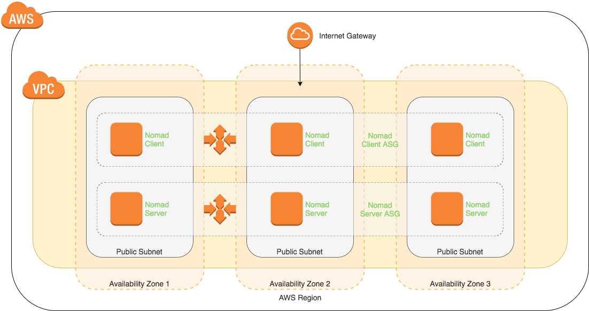

# nomad-cluster

Builds a nomad cluster and joins all clients and servers using awscli commands
rather than depending on consul.

Requires a pre-existing VPC, subnet(s) and SSH key.

Defaults to 3 nomad servers and 5 nomad clients of the t2.micro instance type.



The following resources are created:

  + aws_autoscaling_group.client
  + aws_autoscaling_group.server
  + aws_iam_instance_profile.nomad_instance_profile
  + aws_iam_role.nomad_role
  + aws_iam_role_policy.nomad_policy
  + aws_launch_configuration.client
  + aws_launch_configuration.server
  + aws_security_group.client
  + aws_security_group.server

## Infrastructure Provisioning Steps

1. Copy terraform.tfvars.example to terraform.tfvars:

    `cp terraform.tfvars.example terraform.tfvars`

1. Update the variables with working values for your AWS environment
1. Initialise Terraform to download the required dependencies:

    `terraform init`

1. Execute a plan of the Terraform configuration:

    `terraform plan -out=1.tfplan`

1. Execute an apply of the Terraform configuration:

    `terraform apply 1.tfplan`

## Running the Example Nomad Job

1. Once the instances are running, SSH to one of the servers and determine the leader:

    `nomad server-members`

    Example output:
    ```
    ubuntu@nomad-i-0fa5b6b205edee804:~$ nomad server-members
    Name                              Address        Port  Status  Leader  Protocol  Build        Datacenter  Region
    nomad-i-03b02bfa2a24667ac.global  172.31.37.174  4648  alive   false   2         0.7.0-beta1  dc1         global
    nomad-i-0537d21b70361e800.global  172.31.19.136  4648  alive   false   2         0.7.0-beta1  dc1         global
    nomad-i-0fa5b6b205edee804.global  172.31.14.202  4648  alive   true    2         0.7.0-beta1  dc1         global
    ```

1. SSH to the leader and set `NOMAD_TOKEN` with the Secret ID from the ACL bootstrap process:

    `export NOMAD_TOKEN=$(grep 'Secret' /tmp/bootstrap_output | awk {'print $4'})`

1. Create a new Nomad job file:

    `nomad init`

    > You will need to comment/remove the service check (lines 246-256) in the example.nomad job file if you are not running Consul on the instances

1. Run the Nomad job:

    `nomad run example.nomad`

    Example output:
    ```
        ubuntu@nomad-i-0fa5b6b205edee804:~$ nomad run example.nomad
    ==> Monitoring evaluation "197c5854"
        Evaluation triggered by job "example"
        Evaluation within deployment: "047a3f03"
        Allocation "4a22c77a" created: node "b542089b", group "cache"
        Evaluation status changed: "pending" -> "complete"
    ==> Evaluation "197c5854" finished with status "complete"
    ```

## Infrastructure Termination Steps

To destroy the resources provisioned in this example run:

```
terraform plan -destroy -out=d.tfplan
terraform apply d.tfplan
```
